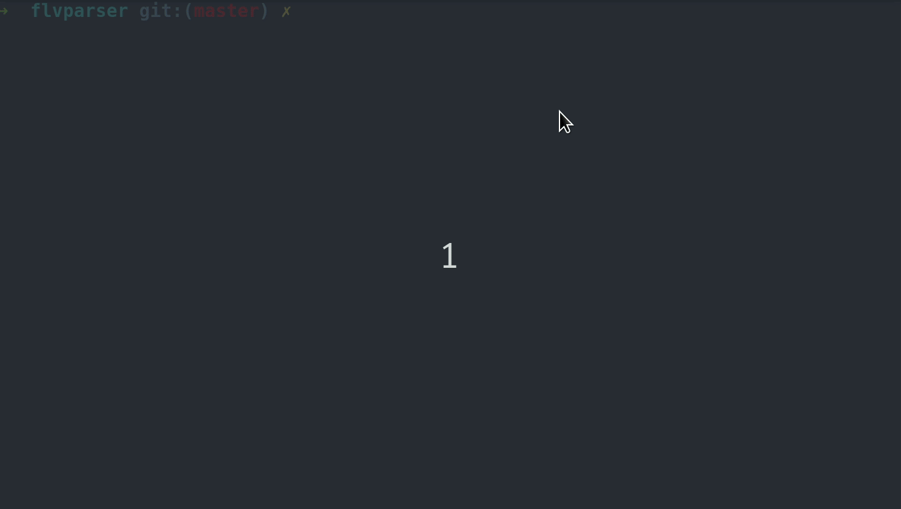

# flvparser

A FLV file parser written in Rust with [nom](https://github.com/Geal/nom).

## Usage

### Simple example

```rust
extern crate flvparser;
use flvparser::{FLVFile, parse_flv_file};

fn main() {
    let flv_file: FLVFile = parse_flv_file(include_bytes!("assets/test.flv")).unwrap().1;
    // ...
}
```

For a detailed example, see [main.rs](src/main.rs)



### Related structure

```bash
FLVFile
├──FLVFileHeader
└──FLVFileBody
   ├──u32 -- first previous tag size
   └──Vec<(FLVTag. u32)>
    
FLVTag
├──FLVTagHeader
└──FLVTagData

FLVTagData
└──ScriptTag/VideoTag/AudioTag

```

## License

MIT